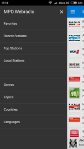

# MPD.Webradio

MPD.Webradio is a simple Webservice that makes it easy to listen Webradio via MPD.




* Search Stations
* Get Stations by Genres, Topics, Countries or Language.
* Recent Stations
* Mark your Favorite Stations
* Responsive Website made with [Phonon Framework](http://phonon.quarkdev.com/)

## Requirements

* [MPD](https://www.musicpd.org/)
* [Nodejs](https://nodejs.org/en/)

## Installation

Create a new User `mpd-wr`

```console
useradd -rU -s /bin/false mpd-wr
```

Install the project under `/opt` using git

```console
cd /opt
git clone https://github.com/nepodev/mpd.webradio.git
```

Install Nodejs dependencies

```console
cd /opt/mpd.webradio
npm install --production
```

Grand access for `mpd-wr` to subdirectory  `var`

```console
chown mpd-wr:mpd-wr /opt/mpd.webradio/var/
```

Create Systemd service

```console
cp /opt/mpd.webradio/systemd/mpd.webradio.service /etc/systemd/system/

systemctl enable mpd.webradio
systemctl start mpd.webradio
```

Check service is running

```console
root@pi:~# systemctl status mpd.webradio
● mpd.webradio.service - MPD.Webradio
   Loaded: loaded (/etc/systemd/system/mpd.webradio.service; enabled)
   Active: active (running) since Sun 2018-03-18 16:51:36 CET; 2h 58min ago
 Main PID: 8769 (node)
   CGroup: /system.slice/mpd.webradio.service
           └─8769 /usr/bin/node /opt/mpd.webradio/index.js
```

Point your Browser to IP of your Pi and Port `4711`.
i. e.: `http://192.168.1.5:4711`

## Customizing

For customizing create a `config.json` under `/opt/mpd-webradio/var`.

* `server` Interface and Port to serve the Website.
* `mpd` Host and Port used by MPD Server
* `radionet` radio.net API-Server. Values for "language" are english, french, austrian or german.

```json
{
    "server": {
        "host": "0.0.0.0",
        "port": 4711
    },
    "mpd": {
        "host": "localhost",
        "port": 6600
    },
    "radionet": {
        "language": "german"
    }
}
```
